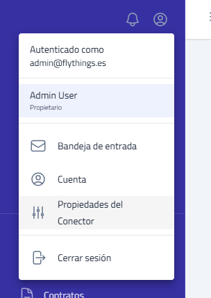
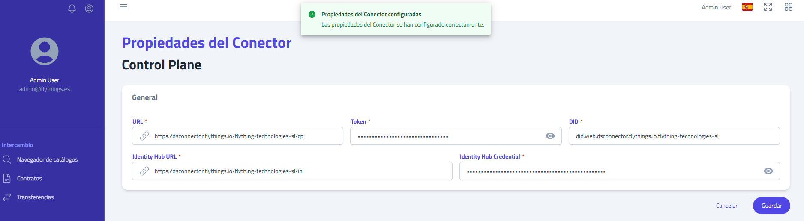

## Indaga Deploy

#### Proxying the app for HTTPS

1. Create neccesary variables:
```sh
export PARTICIPANT=<YOUR EDC PARTICIPANT>
export SUBDOMAIN=<YOUR SUBDOMAIN>
export DOMAIN=<YOUR DOMAIN>
```
2a. With nginx, use the /opt/.indaga-deploy/indaga-dataspace-connector/nginx/proxy.conf.template:
```sh
envsubst '$DOMAIN $SUBDOMAIN $PARTICIPANT' < /opt/.indaga-deploy/indaga-dataspace-connector/nginx/proxy.conf.template > <YOUR_NGINX_CONF_FOLDER>/${SUBDOMAIN}.${DOMAIN}.conf
```
2b. With Apache2, use the /opt/.indaga-deploy/indaga-dataspace-connector/httpd/connector.indaga.io.conf:
```sh
export APACHE="apache2"
envsubst '$DOMAIN $SUBDOMAIN $PARTICIPANT $APACHE' < /opt/.indaga-deploy/indaga-dataspace-connector/httpd/connector.indaga.io.conf > <YOUR_APACHE2_CONF_FOLDER>/${SUBDOMAIN}.${DOMAIN}.conf
```
2c. With HTTPD, use the /opt/.indaga-deploy/indaga-dataspace-connector/httpd/connector.indaga.io.conf:
```sh
export APACHE="httpd"
envsubst '$DOMAIN $SUBDOMAIN $PARTICIPANT $APACHE' < /opt/.indaga-deploy/indaga-dataspace-connector/httpd/connector.indaga.io.conf > <YOUR_APACHE2_CONF_FOLDER>/${SUBDOMAIN}.${DOMAIN}.conf
```
3a. Check SSL files with NGINX (<NGINX_FOLDER>/ssl):
>    - `${DOMAIN}.fullchain.crt`: Fullchain Domain certificate
>    - `${DOMAIN}.key`: Domain key
>    - `ca-bundle-${DOMAIN}.crt`: CA certificate

3b. Check SSL files with Apache (<APACHE_FOLDER>/ssl.crt):
>    - `${DOMAIN}.crt`: Domain certificate
>    - `${DOMAIN}.key`: Domain key
>    - `ca-bundle-${DOMAIN}.crt`: CA certificate

4. Restart your proxy.


#### Install

1. Prepare environment and deploy databases:
```sh
[ ! -d /opt/.indaga ] && mkdir /opt/.indaga
cd /opt/.indaga
cp /opt/.indaga-deploy/indaga-dataspace-connector/indaga-dataspace-connector-init.sh indaga-dataspace-connector-init.sh
#PARTICIPANT is the same as used in the edc-connector setup
echo $PARTICIPANT
echo $DOMAIN
echo $SUBDOMAIN
SERVICE_DNS=https://$SUBDOMAIN.$DOMAIN
chmod +x indaga-dataspace-connector-init.sh && ./indaga-dataspace-connector-init.sh $SERVICE_DNS
rm -rf indaga-dataspace-connector-init.sh
```
2. Check all properties file are correctly configured.
3. Launch compose connector up:
```sh
docker compose -f /opt/.indaga/indaga-dataspace-connector-core.yml up -d
```
4. Wait to auth connector is healthy and modify flyapp TOKEN in connector service:
```sh
watch -n 2 docker ps -a
TOKEN=\`docker logs indaga-core-auth-1 | grep "TOKEN to Fly Apps generated" | awk -F': ' '{print \$NF}'\`
echo \$TOKEN
sed -i "s#\\\${FLYTHINGS_AUTH_TOKEN}#\${TOKEN}#" /opt/indaga-dataspace-connector/application.properties
docker restart indaga-core-connector-1 
```
5. Save and remove the /opt/.indaga/.pass

##### Options
- indaga-dataspace-connector-init.sh options:
  - --no-databases
  - --no-apps
  - --proxy
  - --nginx (depends on --proxy to take effect)
  - --jwt-sign-key ES256 (Default ES256; options: RS256, ES256)

---

#### Linking Indaga Dataspace Connector with the EDC

After the installation, and after creating the first user. You need to Link Indaga Dataspace Connector with the EDC.

1. Access with your user to the Indaga Dataspace Connector.
2. Click on the "person" icon on the top of the sidebar and select "Connector Properties". 
3. Fill the properties with the ones explained in the [EDC README](../edc-connector/README.md#configuration-values-for-the-dataspace-connector-app) 
4. Click "Save".
---

#### Version update

##### Docker Compose

```sh
cd /opt/.indaga
docker compose -f /opt/.indaga/indaga-dataspace-connector-core.yml pull
docker compose -f /opt/.indaga/indaga-dataspace-connector-core.yml up -d --force-recreate
```

##### Docker Swarm

```sh
docker stack deploy --resolve-image "always" --compose-file=/opt/.indaga/indaga-dataspace-connector-core.swarm.yml indaga-dataspace-connector --with-registry-auth
```

#### Uninstall

```sh
cd /opt/.indaga
docker compose -f indaga-dataspace-connector-core.yml down
docker compose -f indaga-dataspace-connector-databases.yml down
docker volume rm $(docker volume ls -q)
rm -rf /opt/.indaga 
rm -rf /opt/indaga-auth /opt/indaga-dataspace-connector
```

---

#### Port Services

##### DBs

| Service    |   Ports    |
| :--------- | :--------: |
| PostgreSQL |    5432    |
| MinIO      | 9090, 9091 |

##### Core Compose

| Service             | Ports |
| :------------------ | :---: |
| Auth                | 8080  |
| Indaga Connector    | 8980  |
| EDC Connector Nginx | 9080  |